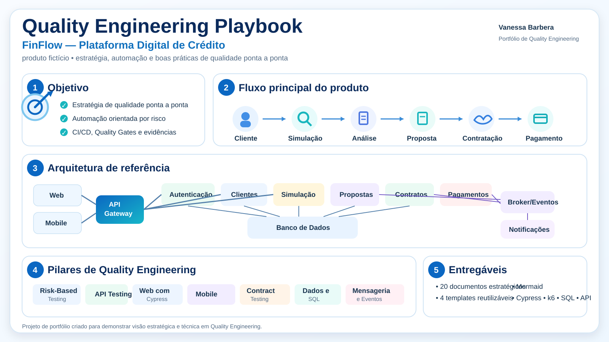

# Quality Engineering Playbook

[](https://github.com/VanessaBarbera/quality-engineering-playbook/actions/workflows/quality-gates.yml)
[](LICENSE)

Playbook prático de **Quality Engineering** com estratégias, decisões, templates e exemplos técnicos aplicáveis ao ciclo de desenvolvimento de software.

O projeto foi criado como portfólio profissional para demonstrar não apenas execução de testes, mas também **raciocínio de qualidade, análise de risco, estratégia de automação, CI/CD, observabilidade e tomada de decisão**.

> **Quality is not a testing phase. It is a strategy applied throughout the software development lifecycle.**

## Visão visual do projeto

<p align="center">
  
</p>

<p align="center">
  <em>Resumo visual do cenário fictício FinFlow, da arquitetura de referência, dos pilares de Quality Engineering e dos principais entregáveis do repositório.</em>
</p>

## Use este template no seu projeto

Este repositório está configurado como **GitHub Template Repository**.

Para reutilizar o playbook:

1. Clique em **Use this template** no topo do repositório.
2. Escolha **Create a new repository**.
3. No novo repositório, comece pelo arquivo **[START-HERE.md](START-HERE.md)** e adapte os templates ao contexto do seu produto.

Você não precisa manter o cenário FinFlow. Ele existe como **exemplo preenchido**. Para um projeto real, substitua o contexto fictício pelas regras, riscos, integrações e critérios do seu próprio produto.

### Caminho recomendado

```text
Use this template
        ↓
START-HERE.md
        ↓
Contexto do produto
        ↓
Matriz de riscos
        ↓
Plano de testes
        ↓
Decisão de automação
        ↓
Quality Gates
        ↓
Execução + evidências
        ↓
Observabilidade + melhoria contínua
```

> A proposta deste template não é impor uma receita pronta, mas oferecer uma estrutura reutilizável para decisões de Quality Engineering.

## Quero reutilizar este playbook

Este repositório foi preparado para ser **adaptado por outros profissionais e times**.

O **FinFlow** é apenas um exemplo preenchido. Se você quiser aplicar a estratégia ao seu próprio produto, comece por:

➡️ **[START HERE — Como reutilizar este Playbook](START-HERE.md)**

O caminho recomendado é:

```text
Contexto do produto
        ↓
Análise de riscos
        ↓
Estratégia de cobertura
        ↓
Decisão de automação
        ↓
Quality Gates
        ↓
Execução e evidências
        ↓
Observabilidade e melhoria contínua
```

### Templates reutilizáveis

- [Contexto do Produto](templates/product-context-template.md)
- [Matriz de Riscos](templates/risk-matrix-template.md)
- [Plano de Testes](templates/test-plan-template.md)
- [Decisão de Automação](templates/automation-decision-template.md)
- [Quality Gates](templates/quality-gates-template.md)
- [Caso de Teste](templates/test-case-template.md)
- [Bug Report](templates/bug-report-template.md)
- [Release Checklist](templates/release-checklist.md)

Também existe um guia mais detalhado em [Como usar este Playbook](docs/00-how-to-use.md).

### Como adaptar

Você pode fazer um **fork** deste repositório ou copiar apenas os templates necessários. Depois substitua o contexto fictício do FinFlow pelas regras, riscos, integrações e critérios do seu produto.

> O objetivo não é copiar decisões prontas. É reutilizar a estrutura de raciocínio e adaptar as decisões ao risco do seu contexto.

## Pipeline executável

Este playbook também possui uma **pipeline real no GitHub Actions**. A cada push ou pull request para a branch `main`, o workflow sobe um pequeno servidor fictício do FinFlow e executa um **smoke de performance com k6**.

Os Quality Gates atuais exigem:

- menos de **1%** de requisições com erro;
- **p95 abaixo de 500 ms**;
- mais de **99%** dos checks aprovados.

Se um threshold não for atendido, a pipeline falha e impede que uma execução reprovada seja tratada como saudável. O relatório do k6 é armazenado como artifact para evidência.

➡️ [Como os Quality Gates são executados](docs/21-running-quality-gates.md)

## Cenário de referência — FinFlow

O playbook utiliza o **FinFlow**, uma plataforma fictícia de crédito digital criada exclusivamente para este portfólio.

```text
Cliente → Simulação → Análise → Proposta → Contratação → Pagamento
```

Esse contexto permite explorar riscos financeiros, integrações, APIs, persistência, eventos, aplicações Web/Mobile e jornadas E2E sem utilizar informações ou processos internos de empresas reais.

## O que este projeto demonstra

- estratégia de qualidade baseada em risco;
- planejamento e priorização de testes;
- pirâmide e distribuição de cobertura;
- decisão sobre o que automatizar;
- testes de API, Web e Mobile;
- testes de contrato;
- consistência de dados;
- mensageria e idempotência;
- CI/CD e Quality Gates;
- performance com k6;
- acessibilidade;
- observabilidade;
- tratamento de flaky tests;
- métricas de qualidade;
- rastreabilidade;
- uso responsável de IA em QA.

## Navegação

### Estratégia e produto

1. [Contexto do FinFlow](docs/01-finflow-context.md)
2. [Estratégia de Qualidade](docs/02-quality-strategy.md)
3. [Análise de Risco](docs/03-risk-analysis.md)
4. [Estratégia de Automação](docs/04-automation-strategy.md)
5. [CI/CD e Quality Gates](docs/05-ci-cd-quality-gates.md)
6. [Decision Log](docs/06-decision-log.md)

### Estratégias técnicas

7. [Testes de API](docs/07-api-testing-strategy.md)
8. [Web com Cypress](docs/08-web-cypress-strategy.md)
9. [Mobile](docs/09-mobile-testing-strategy.md)
10. [Testes de Contrato](docs/10-contract-testing.md)
11. [Banco de Dados e Consistência](docs/11-data-consistency.md)
12. [Mensageria e Eventos](docs/12-messaging-events.md)
13. [Performance com k6](docs/13-performance-k6.md)
14. [Acessibilidade](docs/14-accessibility.md)
15. [Observabilidade](docs/15-observability.md)
16. [Flaky Tests](docs/16-flaky-tests.md)
17. [Métricas de Qualidade](docs/17-quality-metrics.md)
18. [IA aplicada a Quality Engineering](docs/18-ai-for-testing.md)

### Planejamento e rastreabilidade

19. [Cenários de Teste do FinFlow](docs/19-test-scenarios.md)
20. [Matriz de Rastreabilidade](docs/20-traceability-matrix.md)
21. [Execução dos Quality Gates](docs/21-running-quality-gates.md)

## Templates

- [Caso de Teste](templates/test-case-template.md)
- [Bug Report](templates/bug-report-template.md)
- [Release Checklist](templates/release-checklist.md)
- [Plano de Testes](templates/test-plan-template.md)

## Diagramas

- [Contexto do Sistema](diagrams/system-context.md)
- [Fluxo de Qualidade](diagrams/quality-flow.md)

Os diagramas utilizam **Mermaid** e são renderizados diretamente pelo GitHub.

## Exemplos práticos

- [Cypress — contratação](examples/cypress/contratacao.cy.js)
- [k6 — smoke de performance](examples/k6/smoke.js)
- [SQL — validação de contrato](examples/sql/contract-validation.sql)
- [API — exemplo de teste de proposta](examples/api/proposal-test-example.md)

Os exemplos são ilustrativos e utilizam apenas o cenário fictício FinFlow.

## Princípios do Playbook

1. **Qualidade começa antes da execução dos testes.**
2. **Cobertura deve ser orientada por risco e valor de negócio.**
3. **Automação é investimento e precisa justificar custo de manutenção.**
4. **Testes E2E devem proteger fluxos críticos, não concentrar toda a cobertura.**
5. **Falhas precisam produzir evidências úteis para diagnóstico.**
6. **Retry não deve esconder flaky tests.**
7. **Pipeline verde não substitui análise de risco e observabilidade.**
8. **IA apoia o QA, mas decisões relevantes continuam exigindo revisão humana.**

## Abordagem de automação

```text
                E2E
          jornadas críticas

          API / Integração
       regras e contratos

             Unit
       regras isoladas
```

A camada escolhida depende do risco e do objetivo do teste. A estratégia evita automatizar tudo pela interface apenas para aumentar quantidade de casos.

## Fluxo de qualidade

```text
Requisito
   ↓
Análise de risco
   ↓
Planejamento
   ↓
Desenvolvimento
   ↓
Testes por camada
   ↓
CI/CD + Quality Gates
   ↓
Release
   ↓
Observabilidade
   ↓
Feedback contínuo
```

## Estrutura do repositório

```text
quality-engineering-playbook/
├── README.md
├── docs/
│   ├── 01-finflow-context.md
│   ├── 02-quality-strategy.md
│   ├── ...
│   └── 20-traceability-matrix.md
├── templates/
│   ├── test-case-template.md
│   ├── bug-report-template.md
│   ├── release-checklist.md
│   └── test-plan-template.md
├── diagrams/
│   ├── system-context.md
│   └── quality-flow.md
└── examples/
    ├── api/
    ├── cypress/
    ├── k6/
    └── sql/
```

## Status

- [x] Cenário fictício independente
- [x] Estratégia de qualidade
- [x] Risk-Based Testing
- [x] Estratégia de automação
- [x] CI/CD e Quality Gates
- [x] API
- [x] Web/Cypress
- [x] Mobile
- [x] Contract Testing
- [x] Dados e SQL
- [x] Mensageria
- [x] Performance/k6
- [x] Acessibilidade
- [x] Observabilidade
- [x] Flaky Tests
- [x] Métricas
- [x] IA aplicada a QA
- [x] Templates
- [x] Diagramas
- [x] Cenários e rastreabilidade
- [x] Exemplos técnicos
- [x] Pipeline real com k6 e Quality Gates
- [x] Artifact de evidência no GitHub Actions

## Reutilização e licença

Este projeto está disponível sob a **licença MIT**, permitindo uso, cópia, adaptação e distribuição, mantendo o aviso de copyright e a licença.

Contribuições também são bem-vindas. Consulte [CONTRIBUTING.md](CONTRIBUTING.md).

## Autoria

**Vanessa Barbera**

GitHub: [VanessaBarbera](https://github.com/VanessaBarbera)

---

Este material foi criado para fins de estudo e portfólio profissional. **FinFlow é um produto totalmente fictício** e não representa processos, regras de negócio ou informações internas de nenhuma empresa real.
