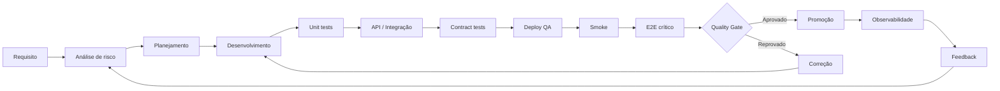

# Diagrama — Fluxo de Qualidade

## Ideia central

Qualidade é um ciclo contínuo. O processo não termina na execução dos testes: métricas, logs e comportamento em produção alimentam novas decisões de risco.
