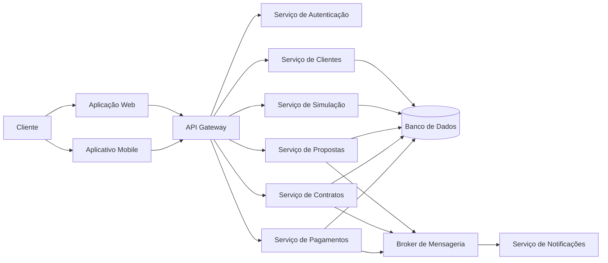

# Diagrama — Contexto do FinFlow

## Objetivo do diagrama

Representar os principais pontos onde a estratégia de testes precisa considerar integração, contrato, persistência, eventos e jornadas de usuário.
